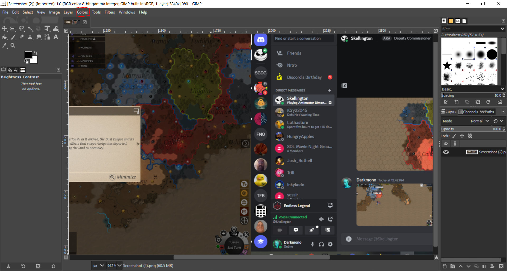
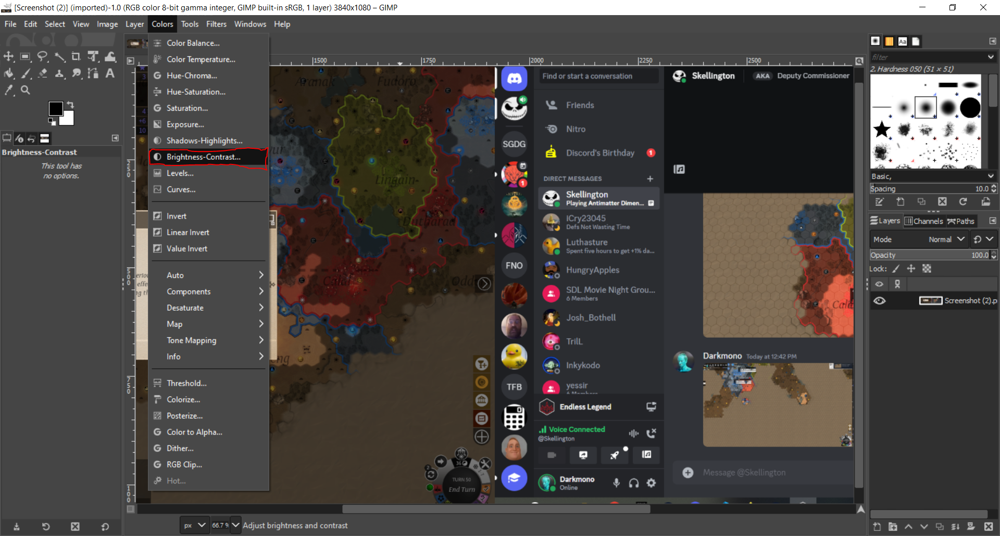
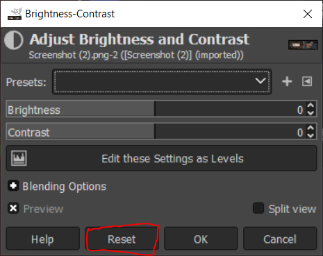
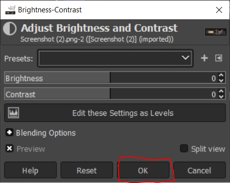
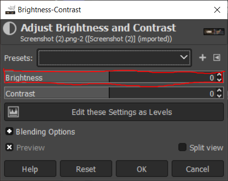
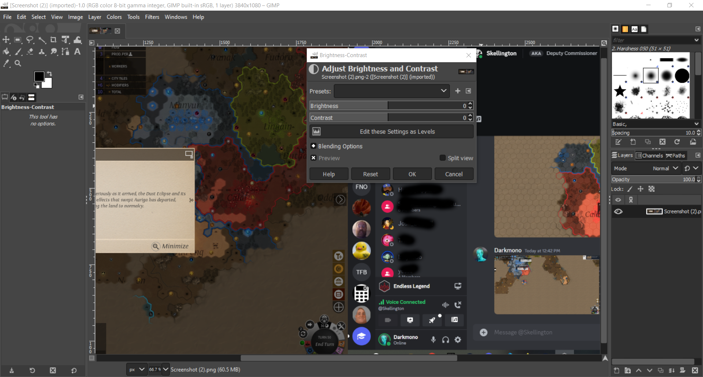
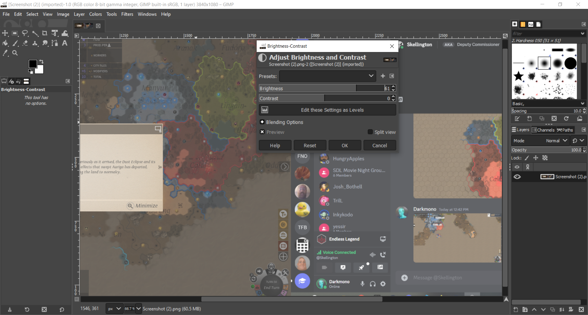
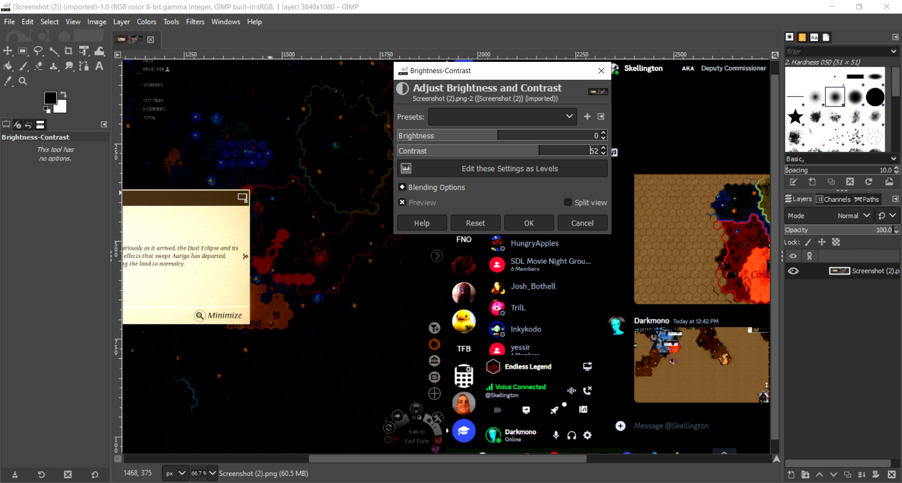
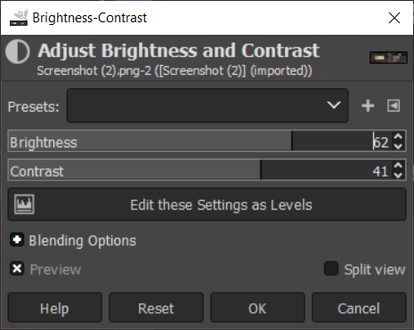

# Using the Brightness Contrast Tool

## Brightness and Contrast 
Brightness changes the overall brightness of an image, while contrast is akin to changing the depth or color dynamic of an image. The defualt value for both is 0.

## Opening the tool 

To locate and use the tool select the color option at the top of the screen as so.

Then in the dropdown select Brightness-Contrast 

The tool will then pop up. It will look like the following.

## Using the tool 

### Before you start 

#### Reset
If there is a change that you have made and you are unsatisyed with it there are steps to undo a change. If a change has been saved, CTL+Z is your method of undo in gimp. Other wise consider the following. 

Note the Reset Button on the tool.

Using this button will allow you to undo the current changes to brightness and contrast , setting both to their defualt value of 0. This is useful for experimenting with different values without commiting the change to your image. 

#### Save

To save an your changes made with the brightness tool click the OK button. This will save your changes and commit them to your photo.

 If you simply wish to leave the tool without saveing click the Cancel Button 

### Brightness 

To change the brightness of an image, open the tool and use the Brightness bar. It can be used like a slider, incremented and decremented with the arrow buttons, or a value can be typed in by clicking the numbers in the brightness bar and entering the desired number

Here is an image before adjusting Brightness

And After brightness has been incresed 

### Contrast

To change the contrast of an image, open the tool and use the Contrast bar. Contrast changes the depth of an image, the lower the value the more everything melds into one, and the higher the more prominent the top color will be. 

Here is an Image before changing the contrast 

Here is an image after adjust Contrast Positivly 

And negativly 

### Presets 
Presets are a way to save a contrast and Brightness for later use. To save a preset Click the + button after setting your brightness and contrast. 

Then name and save your preset by clicking ok in the popup window after setting a name 

you then can select your preset from the preset selection dropdown for use later

