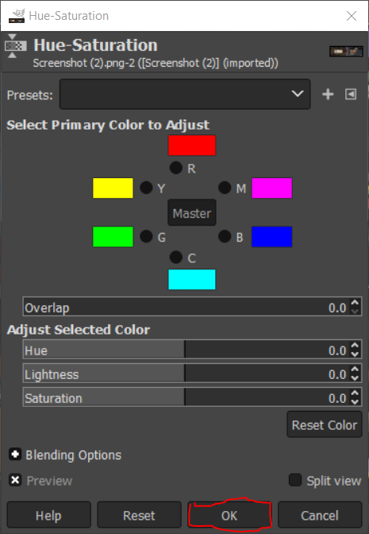
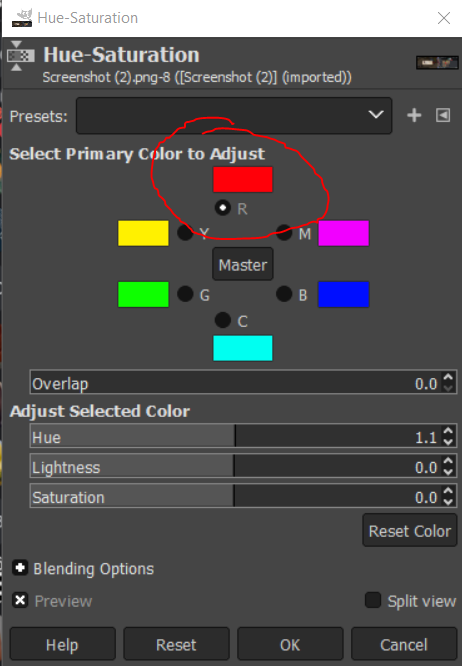
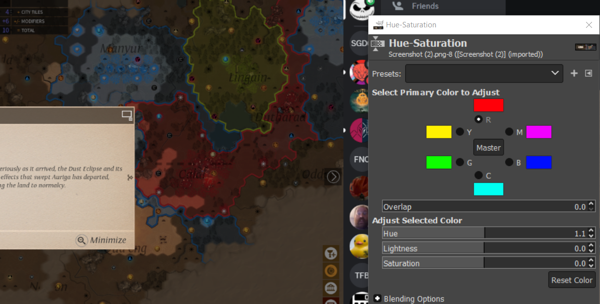
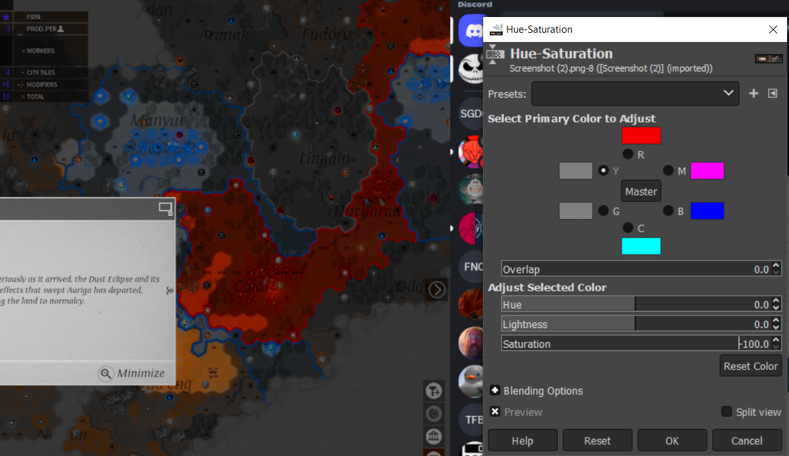

# Using Hue-Saturation in GIMP 

*Written by Robert Gordon*

## What is Hue 

Hue has to do with the dominant color family for a color group. Using Hue we can change color groups en-mass and change our images look. 

Hue is typically used to change a colors position on a color pallet for artists to use in their creations. 

## What is Saturation 

Saturation has to do with how dull or clear an image is. A low saturation maxes the image dull, while high saturation is more clear.

## How to access the Hue-Saturation Tool

On your top toolbar, click the *Colors* tab:

Then select Hue-Saturation... to open the tool.

The tool will look like this:

## Using the Tool 

### Reset
An important feature to note before adjusting any values is the ability to reset 
your changes. 

The bottom reset button resets all colors, while the reset color button resets only the selected color. This resets hue, brightness and saturation to the previous saved setting

### Saving 

 
 Selecting OK will save your changes, to your image, and will put the tool back to its begining state. 
 Ctl+Z can undo this change after a save if desired 

### Hue
Hue can be used in a variety of ways. We will cover the basics in this section.

#### Changing a single color
To change the hue of a single color type, start by clicking on the circle next to the symbol of the color you want to change 
* The key 
    - R : Red
    - M : Magenta 
    - B : Blue
    - C : Cyan 
    - G : Green 
    - Y : Yellow 

Here is an example of selecting the red color:

We can then change the Hue of red to another color. the following is an example image taken before any changes have been made.

*Example image before changing the red hue*

You can now change the hue of red. Slide to adjust the Hue, Lightness, and/or Saturation values indicated under the Adjust Select Color section. Alternatively, you can click the arrows to increment/decrement by one or click on the number and type your desired value. 

> Note: the default value for hue is 0.0

*Example image after changing the red hue. Notice how  mages on the screen that had red in them now are closet to yellow. This is especially apparent on the border picture on the map of the screenshots video game.* 

This will save the state of red if you chose to further adjust other colors.

#### Changing all colors 

In the middle of the color tool there is a Master Button. This button will change the hue of every color for your photos. This can be used to invert color of your images, or set a base of what you want the overall hue to be. 

### Saturation    

Saturation like Hue can be done with all or a single color. 
The default value for saturation is 0. As you descend in value your color will look more gray like so:

The higher the saturation, the more outstanding a color becomes:

### Lightness

This tool also includes lightness of a color.
That is how dark or bright the image will appear. 

This can be adjusted using the Lightness bar found in the tool, selecting a single color or the master set using the button next to the letter to change one color, or master to manipulate the entire image. 

In this example we made Blue's lightness low, and reds is high:

## Color Theory

To truely understand these tools we suggest looking into color theory. A great place to start is [here](https://en.wikipedia.org/wiki/Color_theory).
