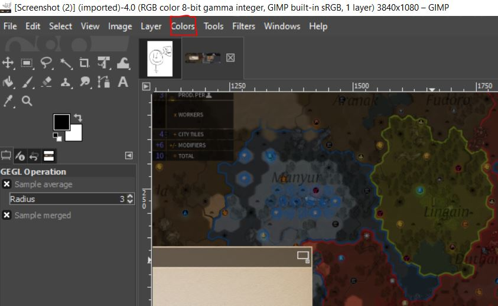
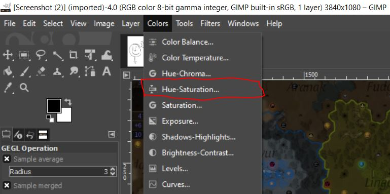
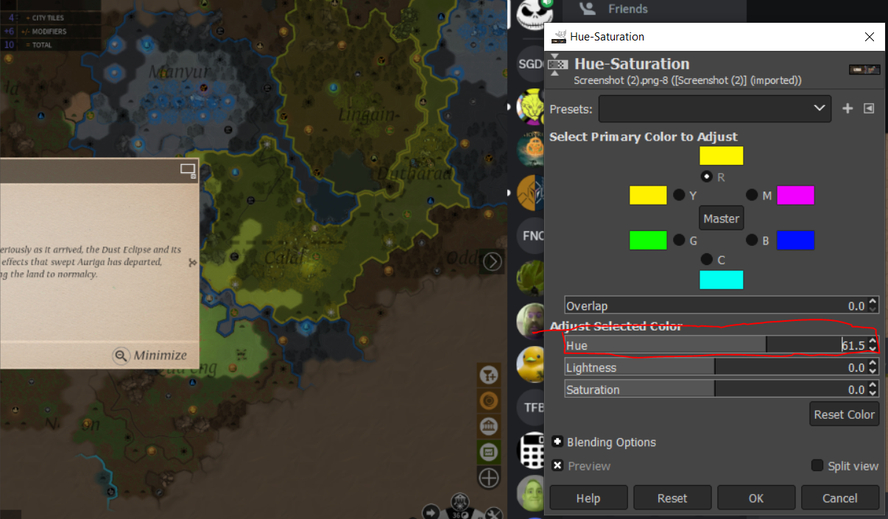
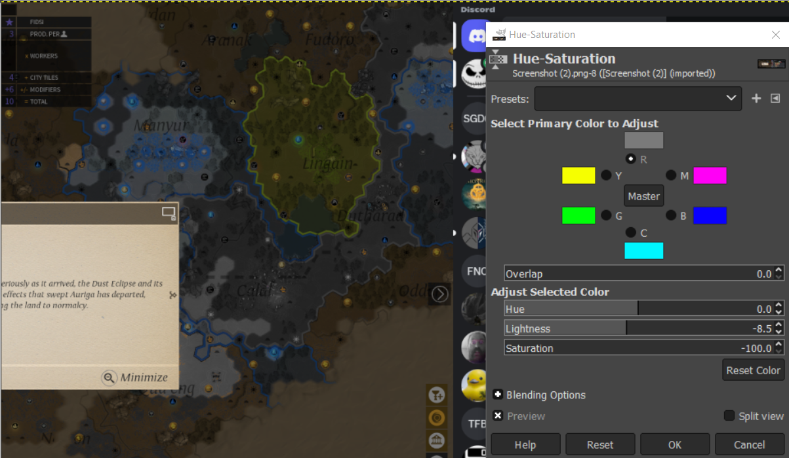
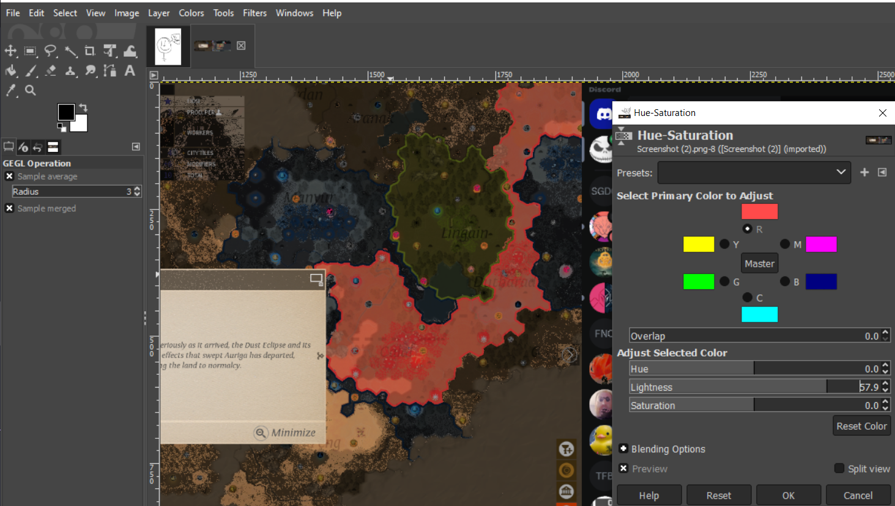

# Using Hue-Saturation in GIMP 

*Written by Robert Gordon*

## What is Hue 

Hue refers to the dominant color family of a specific color group. Using Hue, we can change color groups en masse and alter the look of our images. 

Hue is typically used to change a color's position on a color palette, which artists can use in their creations. 

## What is Saturation 

Saturation relates to how dull or vibrant an image is. A low saturation makes the image dull, while high saturation makes it more vibrant.

## How to Access the Hue-Saturation Tool

On your top toolbar, click the *Colors* tab:

Then select `Hue-Saturation...` to open the tool.

The tool will look like this:

## Using the Tool 

### Reset

An important feature to note before adjusting any values is the ability to reset your changes. 

The bottom reset button resets all colors, while the reset color button resets only the selected color. This resets hue, brightness, and saturation to the previous saved setting.

### Saving 

Selecting `OK` will save your changes to your image, and will reset the tool to its beginning state. 

> Note: You can undo this change after saving using `Ctrl` + `Z`.

### Hue

Hue can be used in a variety of ways. We will cover the basics in this section.

#### Changing a Single Color

To change the hue of a single color type, start by clicking on the circle next to the symbol of the color you want to change. 

* The key:
    - R: Red
    - M: Magenta 
    - B: Blue
    - C: Cyan 
    - G: Green 
    - Y: Yellow 

Here is an example of selecting the red color:

We can then change the Hue of red to another color. The following is an example image taken before any changes have been made.

 *Example image before changing the red hue*

You can now change the hue of red. Slide to adjust the Hue, Lightness, and/or Saturation values indicated under the Adjust Select Color section. Alternatively, you can click the arrows to increment/decrement by one or click on the number and type your desired value. 

> Note: The default value for hue is 0.0

 *Example image after changing the red hue. Notice how images on the screen that had red in them now are closer to yellow. This is especially apparent on the border picture on the map of the screenshots video game.* 

This will save the state of red if you choose to further adjust other colors.

#### Changing All Colors 

In the middle of the color tool, there is a Master Button. This button will change the hue of every color in your photos. This can be used to invert the color of your images, or set a base for what you want the overall hue to be. 

### Saturation    

Saturation, like Hue, can be adjusted for all or a single color. 
The default value for saturation is 0. As you decrease the value, your color will look more gray, like so:

The higher the saturation, the more outstanding a color becomes:

### Lightness

This tool also includes the lightness of a color.
This is how dark or bright the image will appear. 

This can be adjusted using the Lightness bar found in the tool, selecting a single color or the master set using the button next to the letter to change one color, or master to manipulate the entire image. 

In this example, we made Blue's lightness low, and Red's high:

 *Example of adjusting lightness. Blue's lightness is low, and Red's is high.*

## Color Theory

To truly understand these tools, we suggest looking into color theory. A great place to start is [here](https://en.wikipedia.org/wiki/Color_theory).
