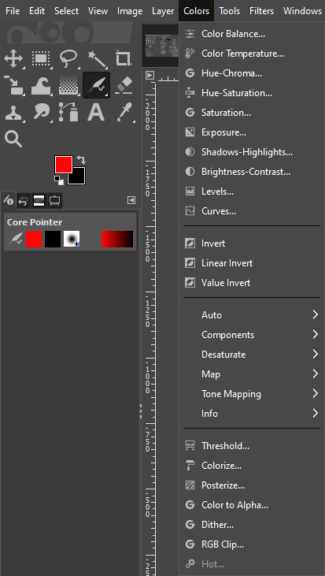

# GIMP Color Tools

*This guide will introduce you to some of the above color tools available in GIMP*

## Color Tools Overview

GIMP provides a variety of color tools to help you manipulate and adjust the colors in your images. These tools include:

- [**Brightness-Contrast Tool**](BrightnessContrastTool.md): Adjusts the brightness and contrast of an image.
- [**Hue-Saturation Tool**](HueSaturationTool.md): Adjusts the hue, saturation, and lightness of your image. 

## Further Reading

If you're still having trouble after this documentation or want to learn more about other tools GIMP has to offer, here are some additional resources:

- [GIMP's official documentation for Color Tools](https://docs.gimp.org/2.8/en/gimp-tools-color.html)