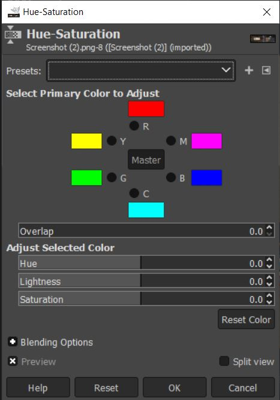

# Using Hue-Saturation in Gimp 

## What is Hue 
Hue has to do with the dominant color family for a color group. Using Hue we can change color groups en-mass and change our images look. 
Hue is typically used to change a colors position on a color pallet for artists to use in their creations. 

## What is Saturation 
Saturation has to do with how dull or clear an image is. A low saturation maxes the image dull, while high saturation is more clear

## How to access the hue-saturation tool
On your top toolbar, click the Color tab 

Then select Hue-Saturation... to open the tool.

The tool will look like this 

## Using the Tool 

### Hue
Hue can be used in a variety of ways. We will cover the basics in this section 
#### Changing a single color
To change the hue of a single color type, start by clicking on the circle next to the symbol of the color you want to change 
* The key 
    - R : Red
    - M : Magenta 
    - B : Blue
    - C : Cyan 
    - G : Green 
    - Y : Yellow 

Here is an example of selecting the red color 

We can then change the Hue of red to another color. The following image will depict an example of changing the red hue.
Before changing the red hue

You can change the hue of red now by changing the value of hue under the Adjust Selected Color section. This can be done by selecting the text box in the slider and typing a number, draging the bar to a location on the slider, or pressing the arrows to increment by one. 
NOTE: the default value for hue is 0.0

Notice how images on the screen that had red in them now are closet to yellow. This is especially apparent on the border picture on the map of the screenshots video game. 

This will save the state of red if you chose to further adjust other colors 

#### Changing all colors 
In the middle of the color tool there is a Master Button. This button will change the hue of every color for your photos. This can be used to invert color of your images, or set a base of what you want the overall hue to be. 

### Saturation     
Saturation like Hue can be done with all or a single color. 
The default value for saturation is 0. As you descend in value your color will look more gray like so 

The higher the saturation, the more outstanding a color becomes. 

### Lightness
This tool also includes lightness of a color.
That is how dark or bright the image will appear. 

This can be adjusted like hue and saturation, selecting a single color or the master set, and using the sliding bar to adjust the values. 
In this example we made Blue's lightness low, and reds high 

## Color theory
To truely understand these tools we suggest looking into color theory. A great place to start is https://en.wikipedia.org/wiki/Color_theory 
