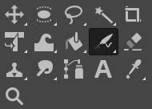
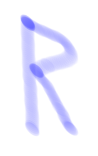
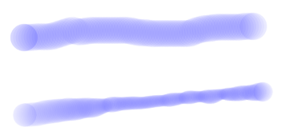

#  *Airbrush Tool*

*Written by Samuel Bjorkman*

## Overview

The  *Airbrush Tool* is a paint tool that paints with varying intensity depending on how long it is held down for. Generally speaking, it is most useful in situations that require soft transitions between colors.

## Activating the  *Airbrush Tool*

The *Airbrush Tool* may be activated by simply pressing `A`. It can also be accessed from the toolbox by left-clicking the airbrush icon.

If the airbrush icon is not displayed in the toolbox, then a tool in the same family will be. Below are the tools in the same tool family as *Airbrush Tool*. One of these tools will be displayed in the toolbox; right-clicking it and then selecting  *Airbrush Tool* will activate the *Airbrush Tool*.

## Basic Usage

Start by holding down your left mouse button, and moving your cursor to paint with the *Airbrush Tool*. Moving slower will result in thicker lines and darker shading, while moving faster will result in thinner lines and lighter shading.

Below, the image on the left shows a line drawn slowly with the  *Airbrush Tool*, while the image on the right shows a similar line drawn quickly.

 

## Tool Options

The tool options for the  *Airbrush Tool* allow you to change the functionality of the tool in useful ways. The tool options dialogue can be accessed by navigating to `Windows>Dockable Dialogues>Tool Options`. 

## Opacity

The first option in the tool options dialogue for the  *Airbrush Tool* is a slider labelled `Opacity`. Adjusting it changes the maximum intensity of a stroke made with the  *Airbrush Tool*. An opacity of 100 will allow you to completely cover the background you're painting over, while an opacity of 0 will produce completely invisible strokes. Anything in between will result in strokes that are partially transparent.

Below, the dot on the left was created by holding down the  *Airbrush Tool* using an opacity of 100, while the dot on the right was made using an opacity of 50.

## Brushes

The second option in the tool options dialogue for the  *Airbrush Tool* is labelled brushes. There will be an icon with the brush currently selected. Clicking this icon reveals all the brushes that can be used with the  *Airbrush Tool*. Changing the brush will change the shape of strokes created using the tool. There are dozens of different brush presets, so you are encouraged to try for yourself which one will work best for what you're trying to do.

## Size 

In the tool options dialogue for the  *Airbrush Tool*, there is a slider labelled `Size`. Changing the size changes the radius of the brush you're using, measured in pixels.

## Aspect Ratio and Angle

In the tool options dialogue, there is a slider labelled `Aspect ratio`, and one below it labelled `Angle`. The aspect ratio changes the ratio of the width and height of the brush. An aspect ratio greater than 0 will result in a brush that is longer horizontally, while a ratio less than 0 will result in a brush that is longer vertically.

Below, on the left, the letter R is drawn using the  *Airbrush Tool* with an aspect ratio of 1.00, while on the right, the same letter is drawn using the  *Airbrush Tool* with an aspect ratio of -1.00.

Changing `Angle` rotates the brush, allowing you to create brushes that are longer along some dimension other than up-down or left-right. The angle is measured in degrees, with 0 degrees being up, and positive angles rotating the brush clockwise.

Below, the letter R is drawn using the  *Airbrush Tool* with an angle of 0, 45, and 90 degrees.

## Spacing

In the tool options dialogue for the  *Airbrush Tool*, there is a slider labelled `Spacing`. This changes the distance between each instance of the brush shape that is drawn when you make a stroke. A lower spacing will result in a smoother stroke, while a higher spacing will result in a stroke that looks like a series of dots.

Below, the line on the left is drawn using the  *Airbrush Tool* with a spacing of 10, while the line on the right is drawn with a spacing of 100.

## Hardness

In the tool options dialogue, there is a slider labelled `Hardness`. A hardness of 100 will result in strokes the exact same shape as the brush being used, producing strokes with hard edges. A hardness any less than 100 will feather the edges of the brush, producing strokes with softer edges.

Below, on the left, a dot is drawn using the  *Airbrush Tool* with a hardness of 100. The dot on the right is drawn with a brush with a hardness of 50.

## Force

In the tool options dialogue, there is a slider labelled `Force`. Changing it will change how fast the tool will fill in strokes.

Below, the top line is drawn using a brush with force set to 20. The bottom line is drawn at about the same speed, but with force set to 100 using the  *Airbrush Tool*.

## Dynamics

In the tool options dialogue, there is a section called `Dynamics`. This allows you to change functionality of the brush depending on the speed at which you paint. To the left, there is a menu with several presets for dynamics. To the right, there is text field displaying the current dynamics preset, from which you can also search for dynamics presets. Below this, there are settings for dynamics that you can manually adjust.

Below, the top line is drawn using a brush with no dynamics. The bottom line is drawn using the  *Airbrush Tool* with the `Basic Dynamics` preset applied. Notice that the stroke becomes thinner at points drawn more quickly. The result is that the brush functions like a real paintbrush, which may be useful in creating certain effects.

