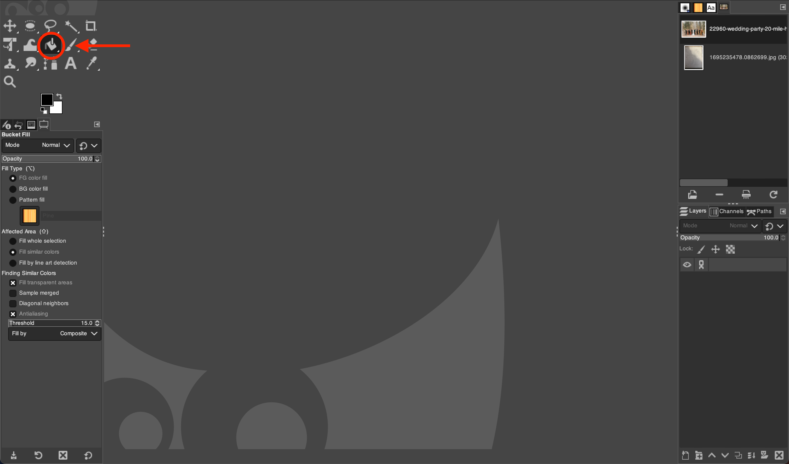
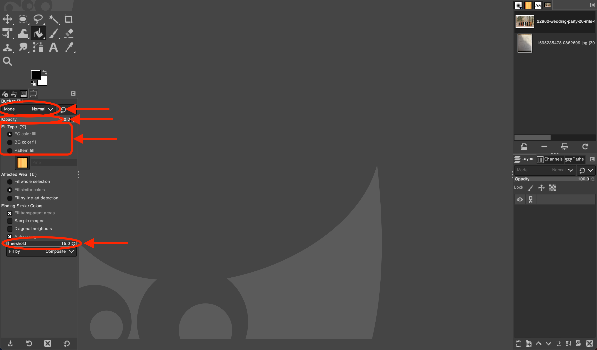

# Using the Bucket Fill Tool in GIMP

*Written by Andrew Stevenson*

## 1. Open GIMP and Your Image:

- Start GIMP on your desktop.
- Go to `File` > `Open` and choose the image you want to modify.

## 2. Select the Bucket Fill Tool:

- In the main toolbox, look for the icon that resembles a paint bucket. Click on it to activate the  *Bucket Fill Tool*. 

- You can also select the Bucket Fill Tool by pressing the shortcut key `Shift + B`.

## 3. Adjust the Bucket Fill Settings:

In the Tool Options panel, adjust the settings for the  *Bucket Fill Tool*:
- **Fill Type:** Choose between `Foreground color fill`, `Background color fill`, and `Pattern fill`
- **Mode:** Select the blending mode for the fill.
- **Opacity:** Set the opacity level of the fill.
- **Threshold:** Determine the range of similar colors the bucket will fill.

## 4. Apply the Fill:

- Click on the part of the image where you want to apply the fill. The  *Bucket Fill Tool* will fill the area based on the color similarity and threshold.
- To fill with a pattern, select the `Pattern Fill` option and choose a pattern from the list.

## 5. Use Fill Transparency:

- For filling transparent areas or adding a layer of transparency, adjust the `Opacity` slider in the Tool Options panel.
- Check the `Sample merged` option to fill considering all visible layers.

## 6. Refine the Fill Area:

- Use the `Threshold` slider to increase or decrease the sensitivity of the fill based on color similarity.
- For more precise control, zoom in and use the `Free Select Tool` (F) to define the area before applying the bucket fill.

## 7. Finalize Your Edits:

- Once you're satisfied with the fill, you can make further edits or enhancements with other GIMP tools.
- Save your changes by going to `File` > `Export As`, and choose your preferred file format and location.

# Tips for the Bucket Fill Tool:

- To quickly switch between the foreground and background fill, click the small double arrow next to the color boxes in the Tool Options.
- If the fill isn't applying as expected, adjust the `Threshold` or check if you have the correct layer selected.
- For a non-destructive workflow, use the Bucket Fill Tool on a new layer and adjust the blending modes for different effects.
- Remember to undo (Ctrl+Z) if the fill goes wrong and try adjusting the settings before applying it again.

