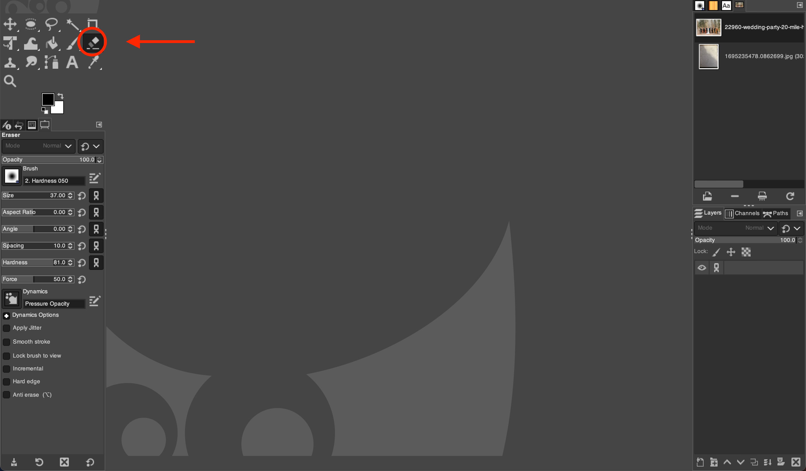
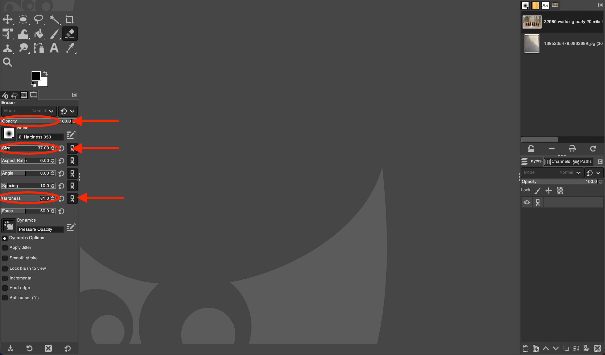
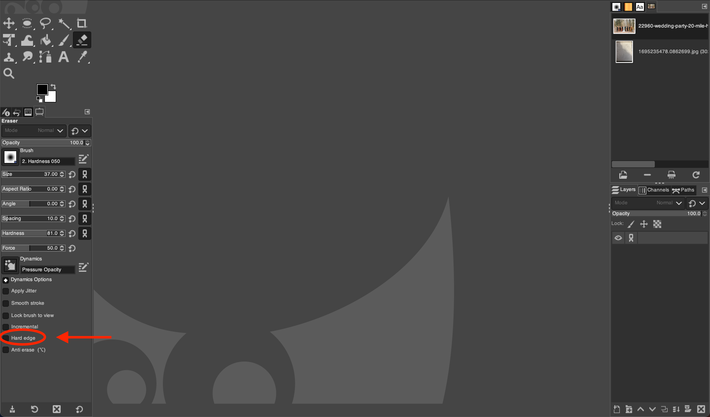

# Using the Eraser Tool in GIMP

*Written by Andrew Stevenson*

## 1. Open GIMP and Your Image:

- Start GIMP on your desktop.
- Go to `File` > `Open` and browse to select the image you want to edit.

## 2. Choose the Eraser Tool:

- Click on the  *Eraser Tool*.
- Alternatively, press the shortcut key `Shift + E` to quickly select the  *Eraser Tool*.

## 3. Configure the Eraser Options:

In the Tool Options panel, which is usually below the main toolbox, you can adjust several settings:
- **Size:** Sets the diameter of the eraser.
- **Hardness:** Determines the softness of the eraser's edges.
- **Opacity:** Controls how transparent the erased area will be.

## 4. Start Erasing:

- Position the cursor over the part of the image you want to erase.
- Click and hold the left mouse button, then drag to erase parts of the image.
- For precision, zoom in and use a smaller brush size.

## 5. Fine-Tune with Eraser Dynamics:

- Dynamics can be used to modify the eraser's effect based on pressure (when using a tablet), speed, and direction.
- Access Dynamics options in the Tool Options panel to select a preset or create your own.

## 6. Save Your Work:

- After making the desired changes, save your image by going to `File` > `Export As`, then choose the appropriate file format and save location.

# More Options

## Erase with Precision:

- Toggle the `Hard Edge` option to switch between a feathered edge and a hard-edged eraser.

## Utilize Layers for Non-Destructive Editing:

- Work on a duplicate layer to ensure the original image remains unaltered. This allows you to erase without permanently removing parts of the original image.
- To create a new layer, go to `Layer` > `Duplicate Layer`.

# Tips for the Eraser Tool:

- Lower the opacity to create a semi-transparent effect, which can be useful for blending or softening edges.
- For hard-to-reach areas, reduce the size of the eraser or zoom in for greater accuracy.
- Remember to frequently save your progress, especially before making significant changes.
- Experiment with different brushes and dynamics to achieve creative effects.
- Use the `Undo` action (Ctrl+Z) to correct any mistakes immediately.

