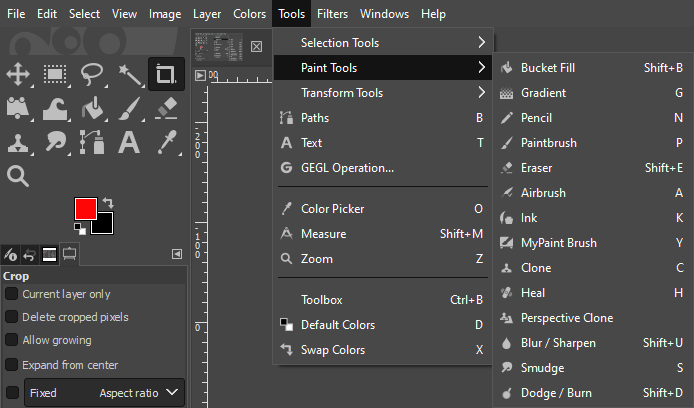

# GIMP Paint Tools Documentation

*This guide will introduce you to some of the above paint tools available in GIMP*

## Paint Tools Overview

GIMP provides a variety of paint tools to help you create and modify the contents of your images. These tools include:

-  [**Airbrush Tool**](AirbrushTool.md): Draws with a soft edge, simulating the effect of an airbrush.
-  [**Bucket Fill Tool**](BucketFillTool.md): Fills a selection with the current foreground color.
-  [**Clone Tool**](CloneTool.md): Copies a portion of an image and paints it onto another location of an image.
-  [**Eraser Tool**](EraserTool.md): Replaces parts of an image with a designated color or a transparent background.
-  [**Smudge Tool**](SmudgeTool.md): Smudges colors on the active layer or a selection.

## Further Reading

If you're still having trouble after this documentation or want to learn more about other tools GIMP has to offer, here are some additional resources:

- [GIMP's official documentation for Paint Tools](https://docs.gimp.org/2.8/en/gimp-tools-paint.html)

Thank you for choosing GIMP as your image editing software. We hope this guide helps you make the most of the paint tools available in GIMP!