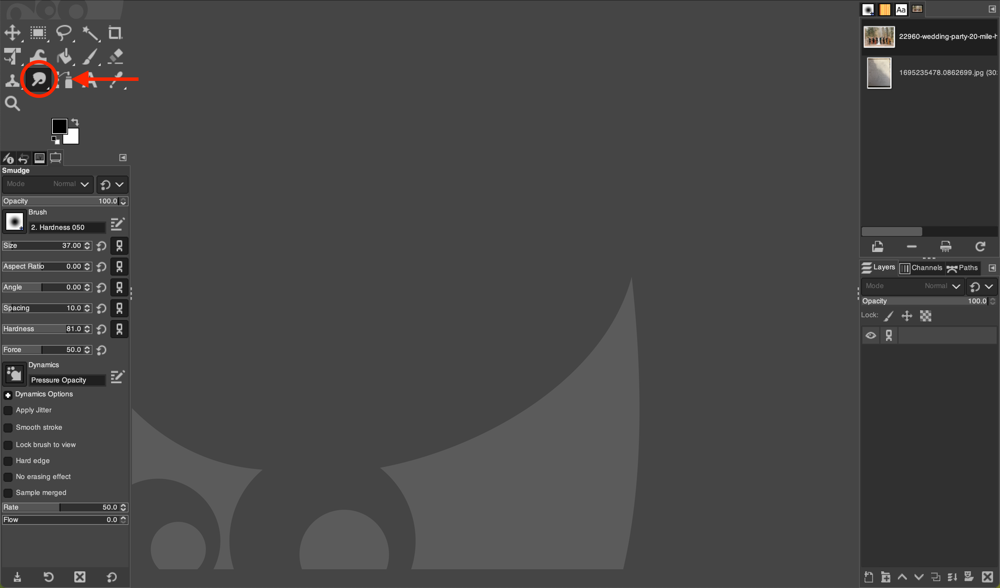
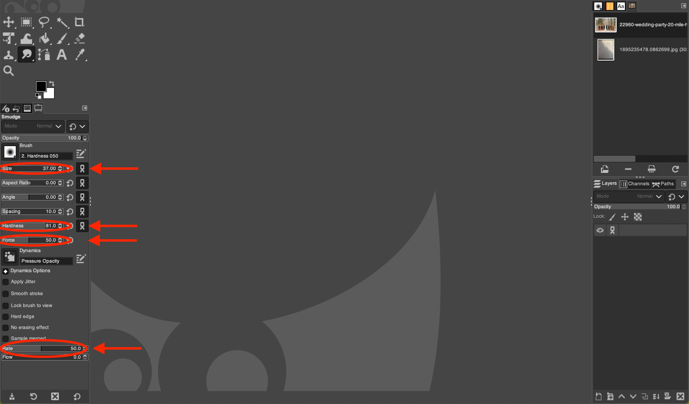
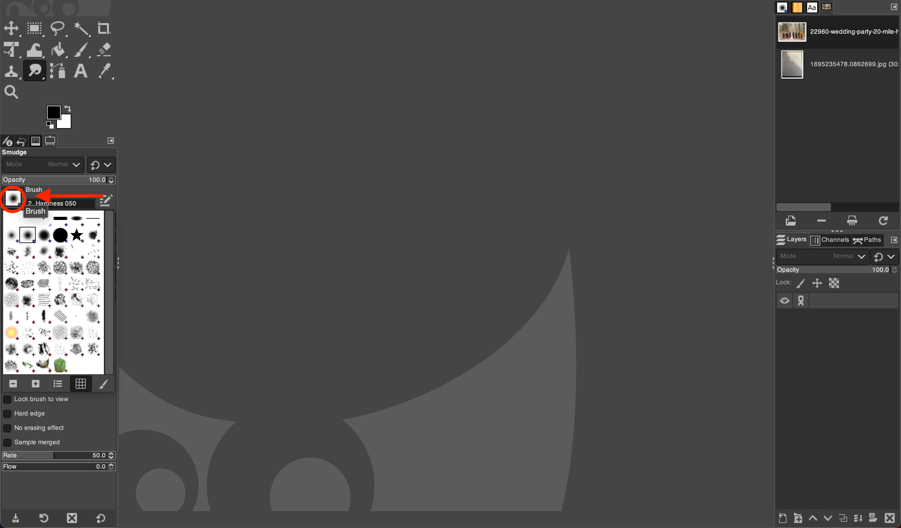

# Using the Smudge Tool in GIMP

*Written by Andrew Stevenson*

## 1. Open GIMP and Load Your Image:

- Start GIMP on your system.
- Navigate to `File` > `Open` and choose the image you wish to edit.

## 2. Select the Smudge Tool:

- Click on the  *Smudge Tool*.
- You can also press the shortcut key `S` to quickly activate the  *Smudge Tool*.

## 3. Configure the Tool Options:

- Within the Tool Options panel, located beneath the main toolbox, you can modify several settings for the  *Smudge Tool*:
  - **Size:** Changes the width of the smudge effect.
  - **Hardness:** Determines the edge hardness of the smudge brush.
  - **Force:** Controls the strength of the smudging effect.
  - **Rate:** Adjusts the speed at which the smudge effect is applied.

## 4. Apply the Smudge Effect:

- Position the cursor over the area of the image you want to smudge.
- Click and hold the left mouse button, then drag the cursor in the direction you wish to smudge.
- The longer you drag, the more pronounced the smudge effect will be.

## 5. Experiment with Different Brushes:

- You can experiment with different brushes for varied smudge effects. Brushes with textured edges can create interesting patterns.
- To change the brush, open the Brush Dialog by clicking on the current brush preview in the Tool Options panel.

## 6. Adjust the Smudge Settings:

- Play with the `Rate` and `Force` settings to vary the intensity and flow of the smudge effect.
- For subtle smudging, use a lower `Force` setting. For more dramatic effects, increase the `Force`.

## 7. Refine Your Work:

- Use the `Undo` function (Ctrl+Z) to revert any smudge actions that didn't go as planned.
- You can also use the `Erase` tool to clean up any unwanted smudge marks.

## 8. Complete and Save Your Project:

- Once you are happy with the smudging, you can make any final adjustments or add additional effects using GIMP's vast array of tools and filters.
- To save your work, go to `File` > `Export As`, then select the desired file format and settings.

# Tips for Using the Smudge Tool:

- For better control, zoom in on the area you're working on.
- Use a tablet with a stylus for a more natural and precise smudging experience.
- Adjust the size of the brush according to the detail level required: smaller brushes for fine details, larger ones for broad smudge strokes.
- Combining the  *Smudge Tool* with different layer modes can create unique effects for your artwork.

