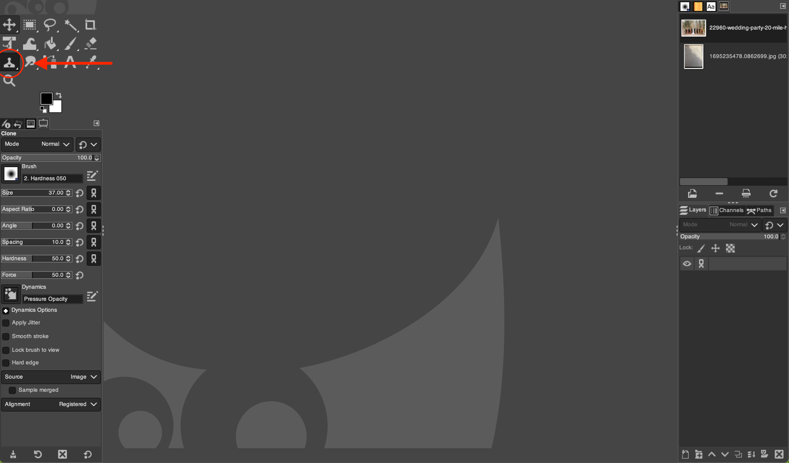
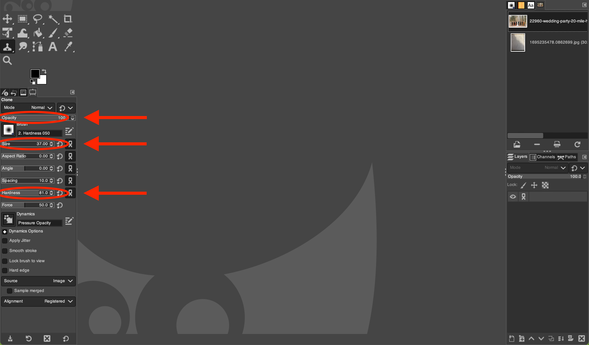

# Using the Clone Tool in GIMP
*Written by Andrew Stevenson*

## 1. Open GIMP and Your Image:

- Launch GIMP on your computer.
- Go to `File` > `Open` and select the image you want to work on.

## 2. Select the Clone Tool:

- In the main toolbox, locate the rubber stamp icon 
, which represents the Clone Tool. Click on it.
- Alternatively, you can press the shortcut key `C` to activate the Clone Tool.

## 3. Adjust the Tool Settings:

- In the Tool Options pane below the main toolbox, you can adjust various settings for the Clone Tool:
  - **Size:** Adjusts the diameter of the brush.
  - **Hardness:** Adjusts the edge softness of the brush.
  - **Opacity:** Adjusts the transparency of the cloned area.

## 4. Set the Clone Source:

- Move the cursor to the area of the image you want to use as a source for cloning.
- Hold down the `Ctrl` key and click once. Note that the cursor changes shape,indicating you are in source mode.
- This sets the source point for cloning.

## 5. Start Cloning:

- Move the cursor to the area where you want to apply the clone.
- Press and hold the left mouse button and start painting over the area you want to cover. As you paint, you'll notice that the source point also moves, indicating which part of the image it's 
sampling from.

## 6. Use Aligned and Non-Aligned Modes:

- By default, the Clone Tool is in "Aligned" mode. This means the distance and direction between the source and destination points remain constant as you paint.
- If you uncheck "Aligned" in the Tool Options pane, each time you click to paint, the cloning will start from the initial source point you set.

## 7. Clone from Another Image:

- If you want to clone from a different image, open that image in GIMP.
- Set the clone source in the second image using the `Ctrl` + click method.
- Switch back to your main image and start cloning. The source will be taken from the second image.

## 8. Finalize and Save:

- Once you're satisfied with the cloning, you can further adjust, edit, or enhance your image using other tools and filters in GIMP.
- To save your edited image, go to `File` > `Export As` and choose your preferred file format and settings.

## Tips:
- Zoom in for more precision while cloning.
- Regularly change the source point to avoid repetitive patterns.
- For large areas, use a bigger brush size, but for detailed work, switch to a smaller brush.

