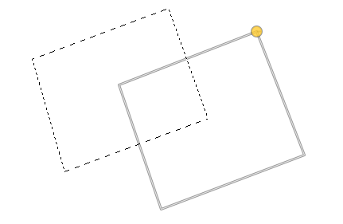
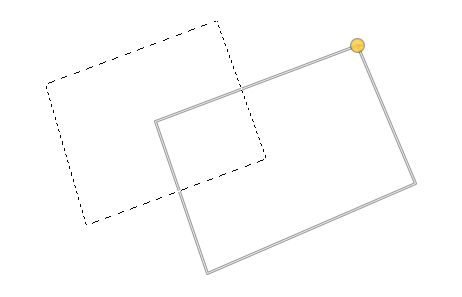
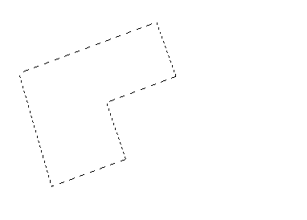
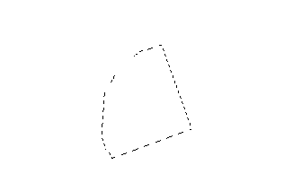
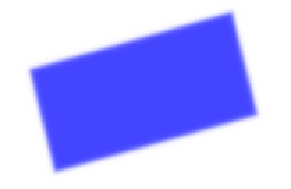

# Free Select Tool

*Written by Samuel Bjorkman*

## Overview

The  *free select tool* is used to create selections of irregular shape. in gimp, a selection is a bounded region that limits where certain tools can be applied. with the  *Free Select Tool*, selections can be formed by drawing an outline, or by placing points to form connected line segments, or by a combination of both. 

## Activating the Free Select Tool

The  *Free Select Tool* can be activated by pressing `F` on your keyboard, or by finding the toolbox and left-clicking the lasso icon.

If the tool bar is not in your window, it can be displayed by navigating to `Windows>Toolbox`, or by using `Ctrl+B`. 

## Basic Usage

To begin creating a selection, left-click anywhere on the canvas. Letting go of your left mouse button and clicking another point on the canvas will form a straight line segment.

 Holding down your left mouse button and dragging your cursor lets you draw a segment in any shape. 

You can keep placing points and drawing lines to form as many consecutive segments as needed. Both drawn and straight segments may be used within the same selection.

Notice that the points forming the edges of segments in the selection being drawn are marked with circles. While creating a selection, the position of any of these points can be moved by clicking and dragging the circle marking it. This will apply transformations to the end of any segments connected to the point.

To complete a selection, click on the point that you started the selection at, then press `F` or select a different tool.

The completed selection will be marked by a dotted line, in the shape of the path you created. As you can see, the selection specifies the area in which the effects of tools apply; for example the pencil tool as shown below:

## Tool Options

The tool options for the  *Free Select Tool* allow you to change the functionality of the tool in useful ways. The tool options dialogue can be accessed by navigating to `Windows>Dockable Dialogues>Tool Options`. 

## Selection Modes

In the tool options dialogue, you can select from four different selection modes:

- Replace the current selection
- Add to the current selection
- Subtract from the current selection
- Intersect with the current selection

`Replace the current selection` will ignore the previous region selected and create a new one.

`Add to the current selection` will include all previous area selected in the new selection. Note that the two regions don't necessarily have to be connected.

| Before adding to selection | After adding to a selection |
|:---:|:---:|
|  |  |

`Subtract from current selection` will keep all previous area selected, except for the area that lies inside the new selected region.

| Before subtracting from a selection | After subtracting from a selection |
|:---:|:---:|
|  |  |

`Intersect with current selection` will keep any previous area selected that lies within the new selected region.

| Before intersecting with a selection | After intersecting with a selection |
|:---:|:---:|
|  |   |

## Anti-Aliasing

In the tool options dialogue, you'll notice an checkbox labelled `Anti-aliasing`. If the box is left unchecked, the edges of the selection will contain entire pixels, producing a blocky texture around the edges. If the box is checked, the edges are smoothed by blending the levels of the effects applied within the selection. Be sure to check or uncheck the box **before** you begin the selection.

Below, the left image shows a shape filled in using a selection without anti-aliasing, and the right image shows the same shape filled in using a selection with anti-aliasing.

| Without anti-aliasing | With anti-aliasing |
|:---:|:---:|
|  |  |

While having anti-aliasing turned on will be more useful in most situations, turning it off can also be useful if you're trying to make changes with pixel-level precision.

## Feather Edges

The last item in the tool options dialogue is a checkbox labelled `Feather edges`. If the box is left unchecked, effects of tools applied within the selected region will stop exactly at the border of the selection. If the box is checked, the effects will gradually have less intensity starting at a certain distance from the border. Checking the box reveals a slider labelled `Radius` that lets you choose this distance, measured in pixels.

Feathering the edges of a selection also rounds any sharp points made on the selection to a certain radius specified by the value that `Radius` is set to.

Below, the left image shows a shape filled in using a selection with `Feather edges` turned on, and a radius of 5 pixels. The right image shows the same shape filled in using a selection with a radius of 15 pixels.

| With 5px feathering | with 15px feathering |
|:---:|:---:|
|  |  |

