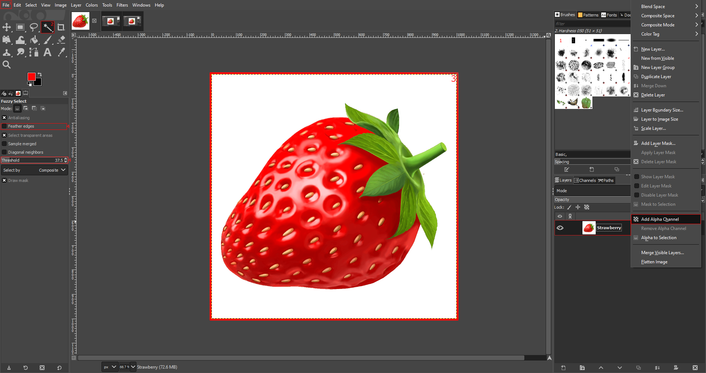

# Using the Fuzzy Select Tool

*Written by Zachary Harrison*

The   *Fuzzy Select Tool* is a powerful tool that allows you to select an area of your image based on its color. 

Here's how to use it:

1. Open your image in GIMP.
   1. Go to the top bar on the left and click `File` > `Open` (Or press `Ctrl` + `O` for Windows and ⌘ `Cmd` + `O` for Mac). 
   2. On the pop-up menu, navigate to your file by clicking on one of the folders on the left or by using the **Location** search bar.
        > If you want to add a folder to the bar on the left for easy access, first navigate to it using the **Location** search bar. Then click on the `+` in the bottom left, and the name of the folder you've selected will show up at the bottom.
2. Select the  *Fuzzy Select Tool* from the Toolbox on the left of your screen. 
2. Select the  *Fuzzy Select Tool* from the Toolbox on the left of your screen. 
3. Click on the area of your image that you want to select. The  *Fuzzy Select Tool* will select all pixels in your image that have a similar color to the one you clicked on. 
4. If the selection is not accurate enough, you can adjust the threshold and feathering of the selection. 
   - The **Threshold** slider determines how similar the colors need to be to be selected. A lower value will select colors that are very similar to the one you clicked on, while a higher value will select a broader range of colors.
   - The **Feathering** option determines how smooth the edges of the selection are. A higher value will create softer, more feathered edges (a gradual transition between two colors), while a lower value will create sharper edges.
   > ${\color{yellow}\text{Note: }}$ In GIMP, when a portion of an image is selected using tools like the  *Fuzzy Select Tool*, that selected area becomes the active focus for any subsequent operations. This means that any changes you make will only apply to this selected area. If you want to manipulate a different part of the image or use other tools that aren't applicable to the selected area, you'll need to deselect the current selection. To do this, navigate to the `Select` menu on the topbar and choose `None` (or press `Shift` + `Ctrl` + `A` for Windows and `Shift` + ⌘ `Cmd` + `A` for Mac). This action will remove the active selection, allowing you to freely use all of GIMP's tools and functionalities on the entire image.
5. Once you're happy with the selection, you can manipulate it using other tools (Move, Rotate, Add Border, etc...), or press `Delete` to replace it with the active background color (located directly below the toolbox).

## Common Uses for the Fuzzy Select Tool

### 1. Making the Background of an Image Transparent

- Follow the aforementioned steps, but before making your selection, right-click on the Layer (shown above, in a red box on the right) and click `Add Alpha Channel`. Then, press `Delete` on your selection and it will become transparent.

### 2. Selecting and Changing a Specific Color

- Follow the aforementioned steps to make your selection.
- Choose the `Bucket Fill Tool` or the `Colorize` function to change the color.

### 3. Adding a Border to an Irregular Object

- Follow the aforementioned steps to make your selection.
- Go to the `Select` topbar menu > `Border`, then choose the width of your border and border style. 
- Fill the border using a Tool of your choice ([Colorize Tool](../Color%20Tools/ColorizeTool.md) or [Bucket Fill Tool](../Paint%20Tools/BucketFillTool.md) are recommended)!

## Tips 

Here are some tips for using the  *Fuzzy Select Tool* effectively:

- **Zoom In**: Press `Ctrl` + `Scroll` with your mouse for Windows or ⌘ `Cmd` + `Scroll` on Mac to zoom in/out. This will help you select more accurately.
- **Add to Selection**: If you accidentally deselect part of your selection, hold down the Shift key and click on the area you want to add back to the selection.
- **Subtract from Selection**: If you want to remove a part of the selection, hold down the `Ctrl` (or ⌘ `Cmd` on Mac) key and click on the area you want to remove from the selection.
- **Invert Selection** If you want to select everything except your current selection, go to `Select` > `Invert` or press `Ctrl` + `I` for Windows and ⌘ `Cmd` + `I` for Mac.

Remember, practice makes perfect. The more you use the  *Fuzzy Select Tool*, the more comfortable you'll become with its settings and capabilities.

## Troubleshooting

- **Tool Not Responding**: If the tool is not responding or behaving unexpectedly, try resetting it. You can do this by going to the `Edit` menu and selecting `Preferences`. In the dialog box that appears, click on `Tool Options` and then `Reset All Tool Options`.

- **Selection Disappears**: Some GIMP tools disappear when you try to use another tool. If this happens, press `Ctrl` + `Z` on Windows or ⌘`Cmd` + `Z` on Mac to undo your previous action(s). If you need to use another tool but keep your selection, go to the `Select` menu and choose `Save to Channel`. You can then reselect it later by going to the `Channels` panel and clicking on the saved selection.

If you're still having trouble, consider searching for your issue on the [GIMP forums](https://www.gimp-forum.net/) or the [GIMP subreddit](https://www.reddit.com/r/GIMP/).