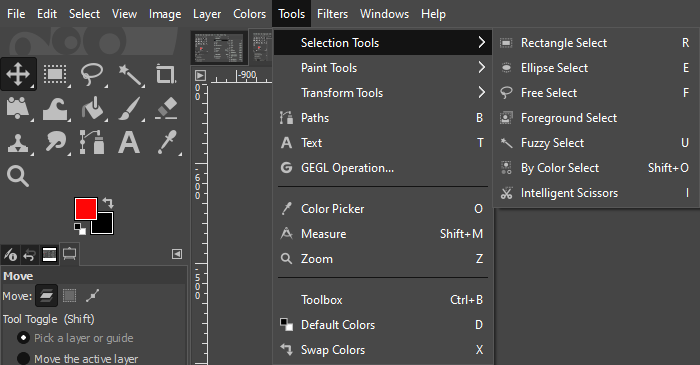

# GIMP Selection Tools

*This guide will introduce you to some of the above  selection tools available in GIMP*

## Selection Tools Overview

GIMP provides a variety of selection tools to help you select specific areas of your image for editing. These tools include:

-  [**Fuzzy Select Tool**](FuzzySelectTool.md): Selects a contiguous region based on color similarity. 
-  [**Free Select Tool**](FreeSelectTool.md): Selects an arbitrary region via freehand or polygonal regions made with straight lines. 
-  [**Rectangle Select Tool**](RectangleSelectTool.md): Selects a rectangular region.  
-  [**Paths Tool**](PathsTool.md): Selects a complex complex region called a Bézier Curve. 

## Further Reading

If you're still having trouble after this documentation or want to learn more about other tools GIMP has to offer, here are some additional resources:

- [GIMP's official documentation for Selection Tools](https://docs.gimp.org/2.8/en/gimp-tools-selection.html)