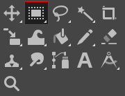
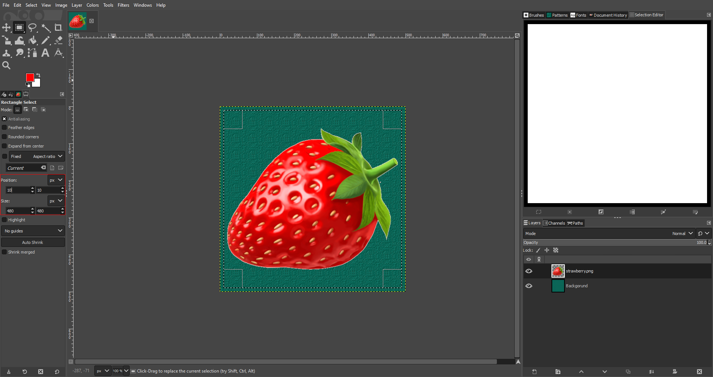
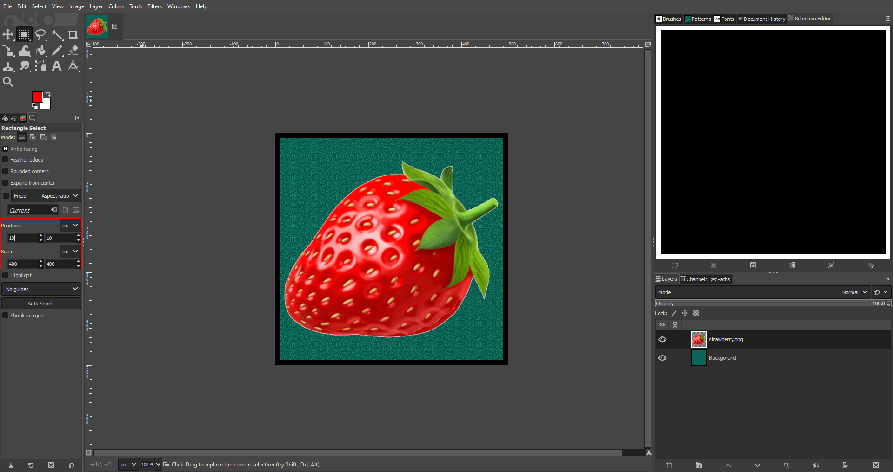

# Using the Rectangle Select Tool

*Written by Zachary Harrison*

The  *Rectangle Select Tool* in GIMP is a powerful tool that allows you to select a rectangular area of your image. Here's how to use it:

## 1. Open an Image

1. On the top-barm, click `File` > `Open` (Or press `Ctrl` + `O` for Windows and ⌘ `Cmd` + `O` for Mac). 
2. On the pop-up menu, navigate to your file by clicking on one of the folders on the left or by using the **Location** search bar.
    > ${\color{yellow}\text{Note: }}$ If you want to add a folder to the bar on the left for easy access, first navigate to it using the **Location** search bar. Then click on the `+` in the bottom left, and the name of the folder you've selected will show up at the bottom.

## 2. Find the  *Rectangle Select Tool*

Click the icon outlined above if it is the  *Rectangle Select Tool*. If it is not, press `F` or hover over its location outlined above and perform the corresponding keyboard actions. 

## 3. Click and Drag

on your image to create a rectangular selection. The  *Rectangle Select Tool* will create a rectangular selection based on where you clicked and dragged.

- Click and drag the small squares on the corners and edges of the selection to resize it.
- Click and drag inside the selection to move it.
> ${\color{yellow}\text{Note: }}$ In GIMP, when a portion of an image is selected using tools like the *Rectangle Select Tool*, that selected area becomes the active focus for any subsequent operations. This means that any changes you make will only apply to this selected area. If you want to manipulate a different part of the image or use other tools that aren't applicable to the selected area, you'll need to deselect the current selection. To do this, navigate to the `Select` menu on the topbar and choose `None` (or press `Shift` + `Ctrl` + `A` for Windows and `Shift` + ⌘ `Cmd` + `A` for Mac). This action will remove the active selection, allowing you to freely use all of GIMP's tools and functionalities on the entire image.

## 4. Manipulate your Selection

To use the mouse, click and dragon on the corners or edges of the boxed selection. To manipulate by value, click in the outlined boxes and modify the *Position* and *Size* values to your liking.

Additionally, GIMP gives various options what to do with a selection like this. For instance, you can instead select everything else by using the Invert option. To do this, you need to either:
 (a) press `Ctrl` + `I` for Windows or ⌘ `Cmd` + `I` for Mac 
 (b) Go to the `Select` topbar and choose `Invert`.

And here is the resulting bordered image:
 

## Tips 

Here are some tips for using the  *Rectangle Select Tool* effectively:

- **Zoom In**: Use the [Zoom Tool](../other/zoomtool.md) to zoom in on your image before using the  *Fuzzy Select Tool*. This will help you select more accurately.
- **Add to Selection**: If you accidentally deselect part of your selection, hold down the Shift key and click on the area you want to add back to the selection.
- **Subtract from Selection**: If you want to remove a part of the selection, hold down the `Ctrl` for Windows or ⌘ `Cmd` for Mac key and click on the area you want to remove from the selection.
- **Invert Selection** If you want to select everything except your current selection, go to `Select` > `Invert` or press `Ctrl` + `I` for Windows and ⌘ `Cmd` + `I` for Mac.

Remember, practice makes perfect. The more you use the  *Rectangle Select Tool*, the more comfortable you'll become with its settings and capabilities.

## Troubleshooting

- **Tool Not Responding**: If the tool is not responding or behaving unexpectedly, try resetting it. You can do this by going to the `Edit` menu and selecting `Preferences`. In the dialog box that appears, click on `Tool Options` and then `Reset All Tool Options`.

- **Selection Disappears**: Some GIMP tools disappear when you try to use another tool. If this happens, press `Ctrl` + `Z` on Windows or ⌘`Cmd` + `Z` on Mac to undo your previous action(s). If you need to use another tool but keep your selection, go to the `Select` menu and choose `Save to Channel`. You can then reselect it later by going to the `Channels` panel and clicking on the saved selection.

If you're still having trouble, consider searching for your issue on the [GIMP forums](https://www.gimp-forum.net/) or the [GIMP subreddit](https://www.reddit.com/r/GIMP/).