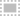

# Using the Rectangle Select Tool

*Written by Zachary Harrison*

The  *Rectangle Select Tool* in GIMP is a powerful tool that allows you to select a rectangular area of your image. Here's how to use it:

1. Open your image in GIMP.
   1. Go to the top bar on the left and click `File` > `Open` (Or press `Ctrl` + `O`). 
   2. On the pop-up menu, navigate to your file by clicking on one of the folders on the left or by using the **Location** search bar.
        > If you want to add a folder to the bar on the left for easy access, first navigate to it using the **Location** search bar. Then click on the `+` in the bottom left, and the name of the folder you've selected will show up at the bottom.
2. Select the  *Rectangle Select Tool* from the Toolbox on the left of your screen. 
3. Click and drag on your image to create a rectangular selection. The  *Rectangle Select Tool* will create a rectangular selection based on where you clicked and dragged.
4. If the selection is not accurate enough, you can adjust the size and position of the selection. 
   - Click and drag the small squares on the corners and edges of the selection to resize it.
   - Click and drag inside the selection to move it.
   > In GIMP, when a portion of an image is selected using tools like the  *Rectangle Select Tool*, that selected area becomes the active focus for any subsequent operations. This means that any changes you make will only apply to this selected area. If you want to manipulate a different part of the image or use other tools that aren't applicable to the selected area, you'll need to deselect the current selection. To do this, navigate to the `Select` menu on the topbar and choose `None` (or press `Shift` + `Ctrl` + `A`). This action will remove the active selection, allowing you to freely use all of GIMP's tools and functionalities on the entire image.

## Tips 

Here are some tips for using the  *Rectangle Select Tool* effectively:

- **Zoom In**: Use the zoom tool to zoom in on your image before using the  *Rectangle Select Tool*. This will help you select more accurately.

- **Add to Selection**: If you accidentally deselect part of your selection, hold down the Shift key and click on the area you want to add back to the selection.

- **Subtract from Selection**: If you want to remove a part of the selection, hold down the Ctrl (or Command on Mac) key and click on the area you want to remove from the selection.

- **Use in Combination with Other Tools**: The  *Rectangle Select Tool* can be used in combination with other tools for more complex edits. For example, after making a selection with the  *Rectangle Select Tool*, you can use the Move tool to move the selected area, or the Bucket Fill tool to fill the selected area with a different color.

- **Save Selections for Later**: If you've made a complex selection that you might want to use again later, you can save it as a channel. To do this, go to the `Select` menu and choose `Save to Channel`. You can then reselect it later by going to the `Channels` panel and clicking on the saved selection.

Remember, practice makes perfect. The more you use the  *Rectangle Select Tool*, the more comfortable you'll become with its settings and capabilities.

## Troubleshooting

If you're having trouble with the  *Rectangle Select Tool*, here are some common issues and their solutions:

- **Tool Not Responding**: If the tool is not responding or behaving unexpectedly, try resetting it. You can do this by going to the `Edit` menu and selecting `Preferences`. In the dialog box that appears, click on `Tool Options` and then `Reset All Tool Options`.

- **Can't Select the Desired Area**: If you're having trouble selecting the area you want, make sure you're clicking and dragging from the correct starting point. The  *Rectangle Select Tool* creates a selection based on where you first click, so try starting your selection from a different point.

- **Selection Disappears**: If your selection disappears when you try to use another tool, make sure you haven't accidentally deselected it. If you need to use another tool but keep your selection, go to the `Select` menu and choose `Save to Channel`. You can then reselect it later by going to the `Channels` panel and clicking on the saved selection.

- **Can't Move Selection**: If you're unable to move your selection, make sure you're clicking inside the selection before you drag. If you click outside the selection, the  *Rectangle Select Tool* will create a new selection instead of moving the existing one.

If you're still having trouble, consult the GIMP user manual or seek help from the GIMP community.