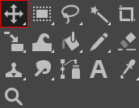
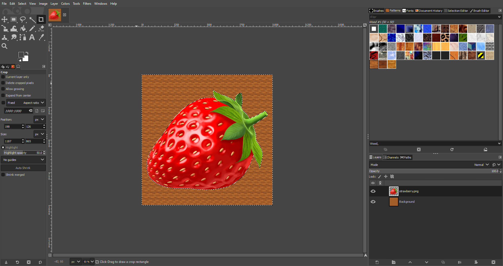
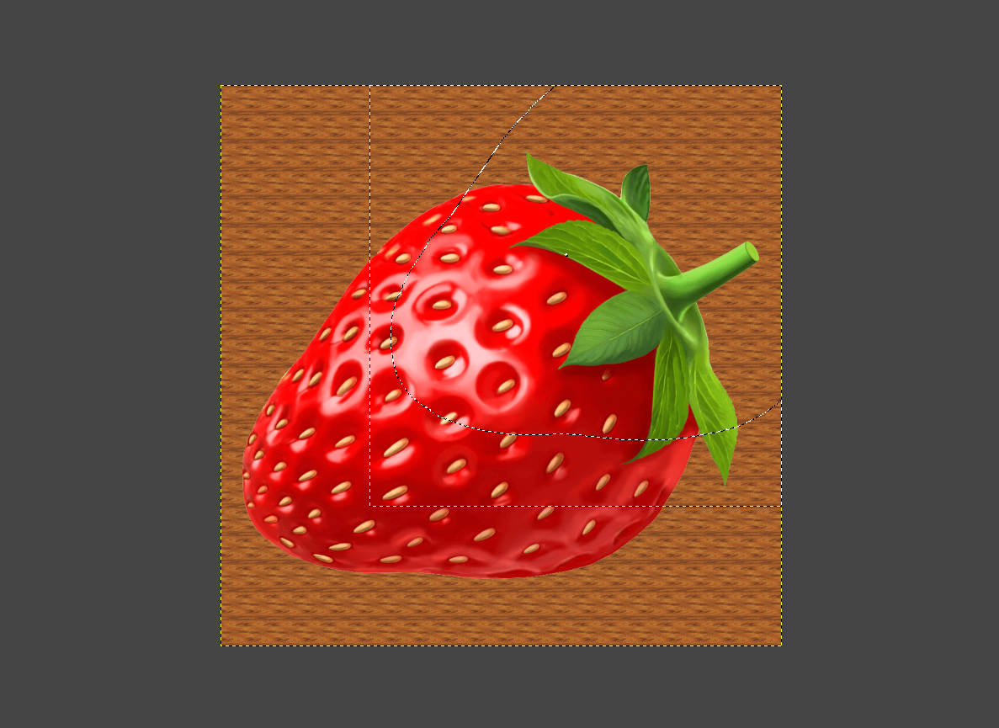

# Using the  *Move Tool*
*Written by Zachary Harrison*

## 1. Open an Image

1. Go to the top bar on the left and click `File` > `Open` (Or press `Ctrl` + `O` for Windows and ⌘ `Cmd` + `O` for Mac). 
2. On the pop-up menu, navigate to your file by clicking on one of the folders on the left or by using the **Location** search bar.
    > If you want to add a folder to the bar on the left for easy access, first navigate to it using the **Location** search bar. Then click on the `+` in the bottom left, and the name of the folder you've selected will show up at the bottom.

## 2. Find the  *Move Tool*

Click the icon outlined above if it is the  *Move Tool*. If it is not, press `M` or hover over its location outlined above and perform the corresponding keyboard actions. 

## 3. Choosing Move Transform

You can move a  Layer,  Selection, or  Path.
> $\color{yellow} \text{Note:}$ Because moving a path is relatively rare, I won't cover it here. 

This image is before any moving:
  

|  **Layer** |  **Selection** |
|:---:|:---:|
|  |  |

What? Nothing happened when we moved the selection! That's because the selection itself was moved, not the pixels it was selecting. As proof, here's what it looks like after coloring in the moved selection:
  
  Previously, if we tried to color in the selection, we would've re-colored the wood-like pattern.

## Troubleshooting

If you're still having trouble, consider searching for your issue on the [GIMP forums](https://www.gimp-forum.net/) or the [GIMP subreddit](https://www.reddit.com/r/GIMP/).