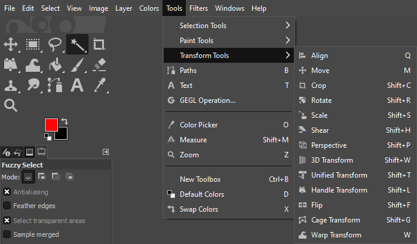

# GIMP Transform Tools

*This guide will introduce you to some of the above transform tools available in GIMP*

## Transform Tools Overview

GIMP provides a variety of transform tools to help you manipulate the shape, size, and orientation of your image or selected areas. The tools we provide documentation for are:

-  [**Move Tool**](MoveTool.md): Moves layers, selections, paths or guides.
-  [**Crop Tool**](CropTool.md): Crops/clips an image.
-  [**Rotate Tool**](RotateTool.md): Rotates layers, selections or paths.
-  [**Scale Tool**](ScaleTool.md): Resizes layers, selections or paths.

## Further Reading

If you're still having trouble after this documentation or want to learn more about other tools GIMP has to offer, here are some additional resources:

- [GIMP's official documentation for Transform Tools](https://docs.gimp.org/2.8/en/gimp-tools-transform.html)