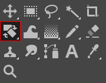
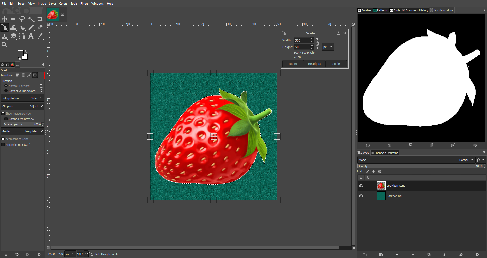
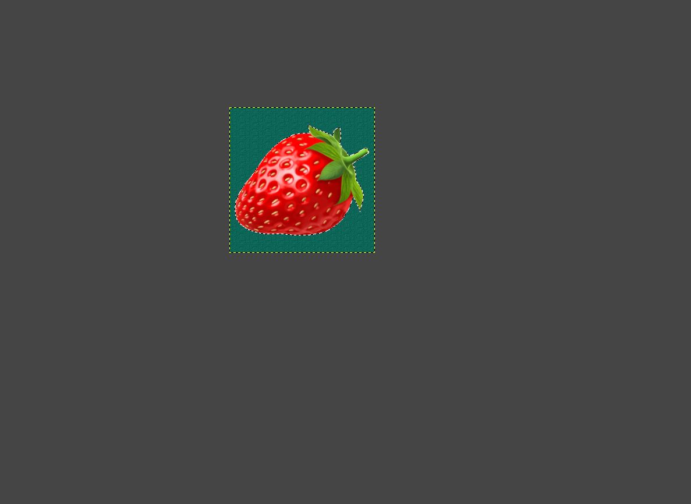

# Using the Scale Tool

*Written by Zachary Harrison*

## 1. Open an Image

1. Go to the top bar on the left and click `File` > `Open` (Or press `Ctrl` + `O` for Windows and `Cmd`⌘ + `O` for Mac). 
2. On the pop-up menu, navigate to your file by clicking on one of the folders on the left or by using the **Location** search bar.
    > If you want to add a folder to the bar on the left for easy access, first navigate to it using the **Location** search bar. Then click on the `+` in the bottom left, and the name of the folder you've selected will show up at the bottom.

## 2. Find the Scale Tool

Hover over the  `Rotate Tool` outlined above. After about a second, a pop-up will display keyboard shortcuts for various different tools related to Rotate. Press the keyboard shortcut for the  `Scale Tool`.
> This will cause the  `Rotate Tool` Icon to be replaced by the  `Scale Tool` icon. To reverse this, repeat the previous step, but instead press the keyboard shortcut for  `Rotate Tool`.

## 3. Choosing Scale Transform

To make sure you're scaling the right thing, choose the correct Scale Transform:

You can scale a Layer, Selection, Path, or Image. Because scaling a path is relatively rare, I won't cover it here. 

This image is before scaling:

> Note how you can type into the Scale box in the top right OR use your mouse to click on one of the boxes on the image drag the image to an approximate size. For simplicity, **I resized from 500x500 to 250x250 in the following proceeding examples**.

**Image**

| During Scaling | After Scaling |
|:---:|:---:|
|  |  |

**Layer**

| During Scaling | After Scaling |
|:---:|:---:|
|  |  |

**Selection**

| During Scaling | After Scaling |
|:---:|:---:|
|  |  |

Something strange about this is that nothing happened! That's because the selection itself was scaled, not the pixels it was selecting. Here's proof:

